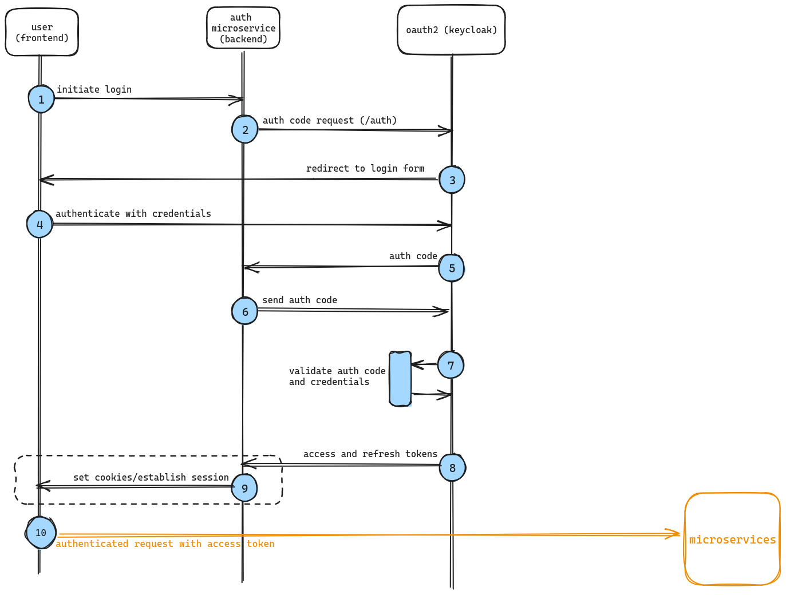
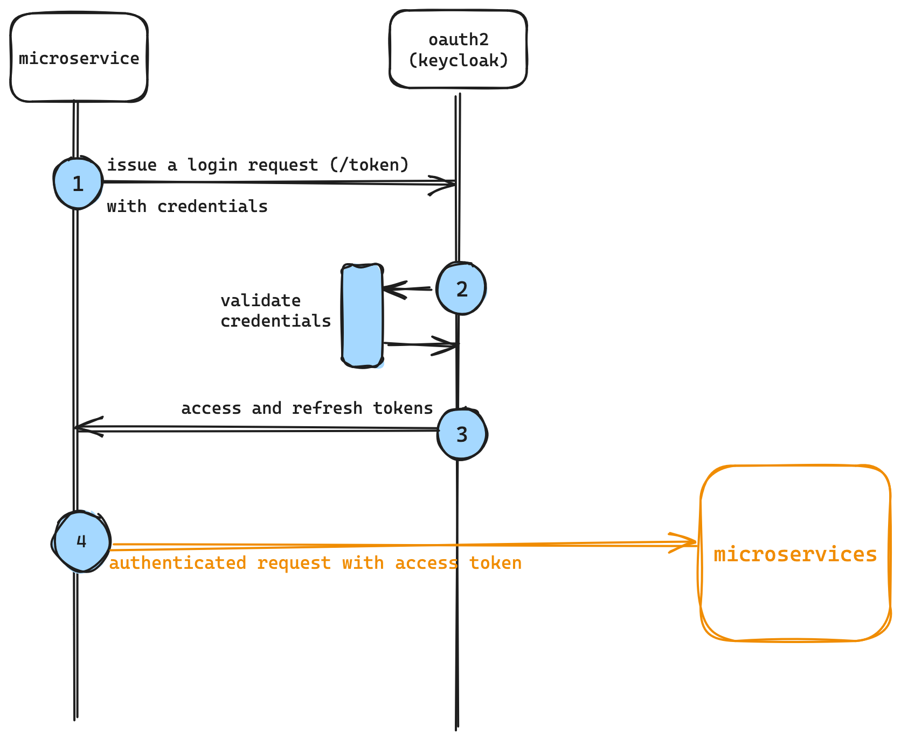

# Chapter I: introduction to OAuth2 with Keycloak
We mentioned that OAuth2 is a protocol, a _standard_, not something we can run: OAuth2 is a specification, not an application. 
To leverage the OAuth2 standard we must use a OAuth2-compliant __identity management provider__ (IDP), which is fancy for "a system composed by one or more servers that all run an application that does the authorization and authentication instead of us".
 
One of the leading IDPs is [Keycloak](https://www.keycloak.org/), developed and maintained by RedHat, which also happens to be completely open source and self-hostable. Other than that, Keycloak has a [vibrant and large community](https://github.com/keycloak/keycloak/pulls), definitely a plus when it comes to open source self-hostable projects.

## The nuts and bolts of OAuth2
How do we effectively gain access to resources protected by an OAuth2 authorization scheme? The answer is simple: through a __flow__, a standard set of steps that the IDP will go through while authenticating a client's identity. 
The main flows that we will use in our journey through this project are the __authorization code flow__ and the __service account flow__.  
The first is used when the application that is requesting access to a protected resource is a __web__ or __mobile__ application, or really any application that is __user-driven__, whereas the latter is used when we need to authenticate __requests made from other programs that are not user-driven__ (i.e. a microservice!). 
Both of these flows will output two, very important, pieces of information: the __`access token`__ and the __`refresh token`__, which are the foundations to OAuth2's authorization system. 

- The `access token` is used to __issue authenticated requests to our microservices__. It's our passport __into the system__ and it has a very short lifespan: this is a key characteristic of access tokens; tokens that grant __access__ to protected resources _should_ have a short TTL, because __tokens leak__, security protocols are __breached__, things always take the wrong turn with microservices. For these reasons, access tokens should live as short as possible, because, if stolen, they will grant access to the system on behalf of the user that got the token in the first place.
This token can be `Opaque`, a random, meaningless string, or a `JWT` that encodes information. We will use a `JWT`.
- The `refresh token` is used to __get new access tokens when they expire__. They are (very) long-lived with respect to __access tokens__ and, needless to say, they are equally important and must be stored carefully and safely.

### Authorization code flow
Here's a picture that describe how the user gets into the system with the authorization code flow. 
We will use the "basic" version, without [PKCE](https://oauth.net/2/pkce/), because of simplicity and also because PKCE is mainly related to mobile apps (but it's an additional layer of security that every client can benefit of, web apps included).

1. the user clicks on the login button (or follows a login link);
2. the backend issues an authorization code request, this starts a redirection process to the login form. The authorization code will make sure that the request for the access and refresh token is not forged.
3. the user gets redirected to the login form;
4. the user authenticates;
5. if the credentials are correct, the auth code is issued and sent to the backend;
6. once the auth code is received, the backend issues another request to retrieve the tokens. Note, again, that the auth code's presence is critical to mitigate security risks: by issuing an auth code, the client __never directly contacts the OAuth2 server__ and the authentication flow is completely delegated to the server. This enforces security and doesn't allow privileged access to the OAuth2 server from potentially vulnerable clients; imagine what would happen if the authorization code didn't pass through the server, but was instead passed to a vulnerable client: if the authorization code gets intercepted by an attacker, the entire authorization session would be stolen, and malicious third parties could authenticate on the vulnerable client's behalf. Instead, it's the backend that requests credentials with the authorization code and the OAuth2 server is configured to accept authentication requests from the server only, thus, hardening security;
7. the OAuth2 server validates the code and the credentials;
8. the tokens are issued and...
9. ...a session is issued between the backend and the frontend;
10. the frontend can now make authenticated requests to other microservices;

### Service account flow
As already mentioned, the service account flow is used by non-user driven processes, i.e. applications that aggregate user data (CQRS microservices) or notification services that query other microservices for reports and similar things.
.

1. the microservice has some pre-generated credentials with which it will make a request for tokens;
2. the OAuth2 service validates the credentials...
3. ...and returns the tokens to the microservice;
4. authenticated requests can now be sent to other microservices.

Notice how the flow is much shorter and simpler: that's because one can make stronger assumptions about the microservice, which means that it can be presumed much less likely to be vulnerable with respect to malicious third parties. 
Nevertheless, credentials on the microservice must be safely handled and rotated periodically.

### Access token usage

### Refresh token usage