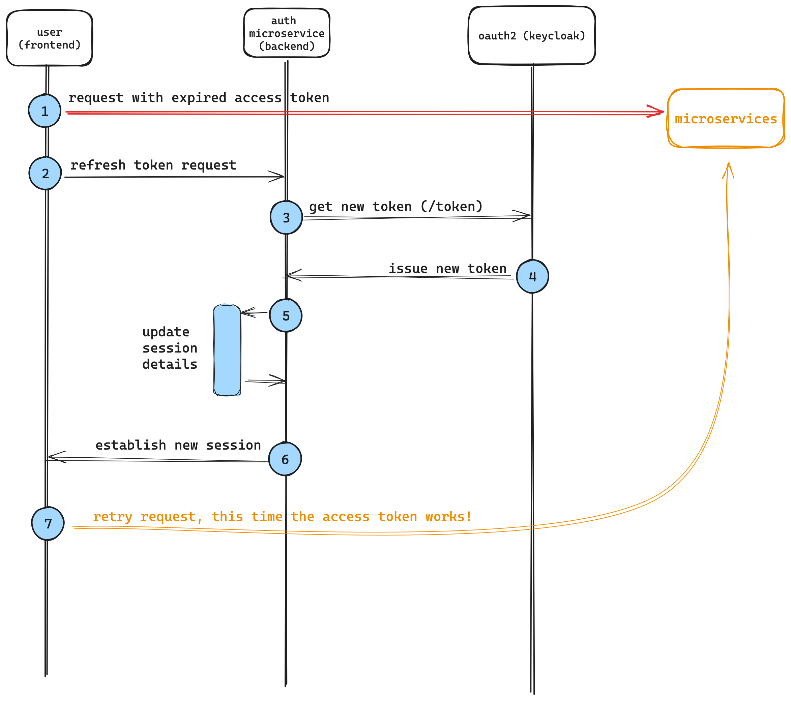
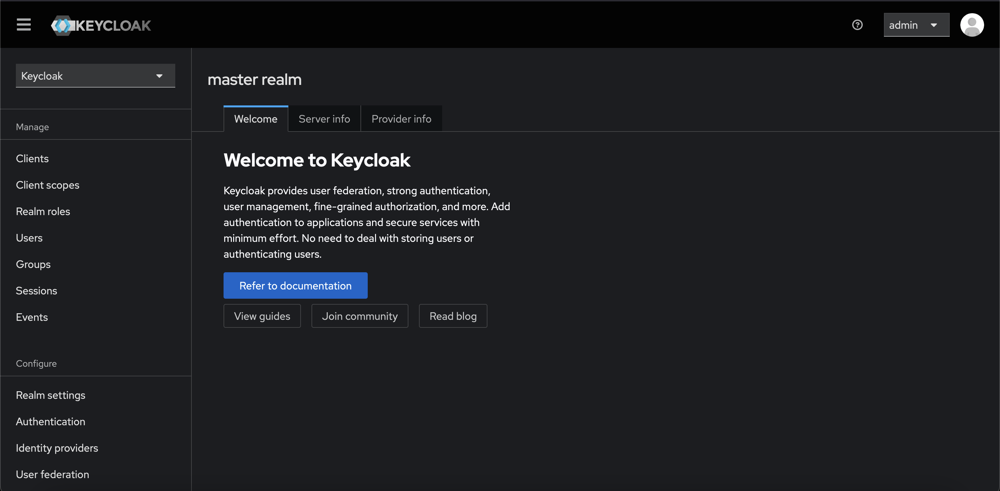
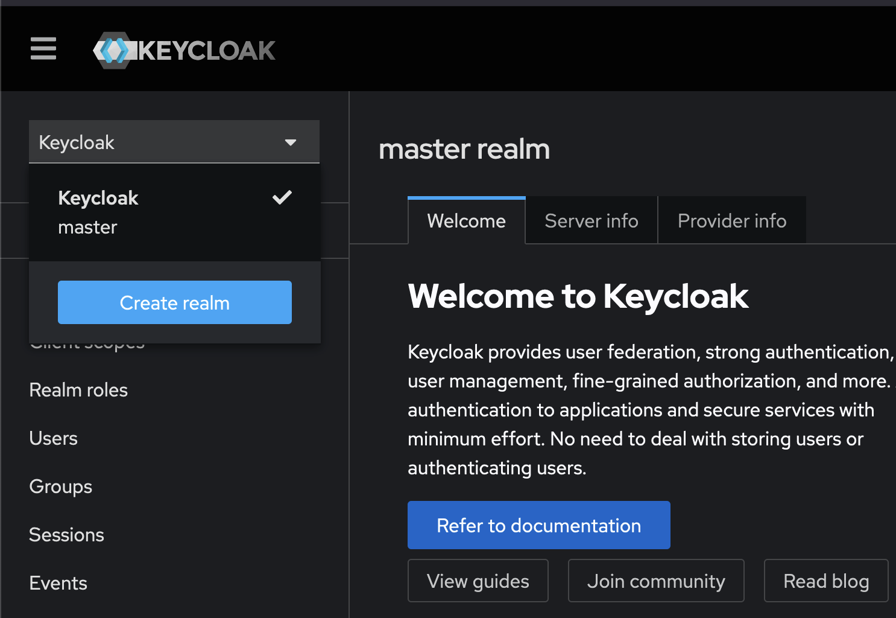
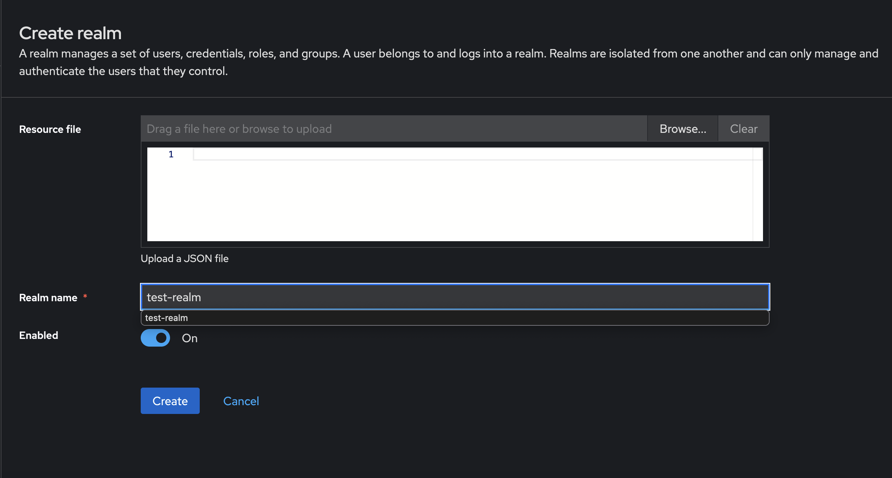
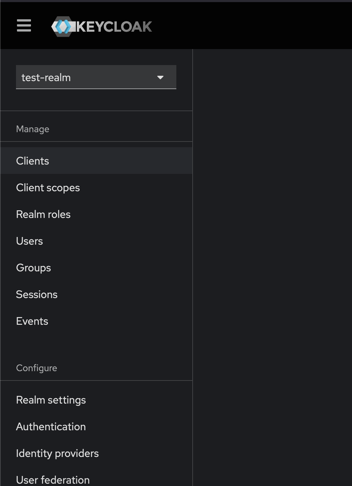
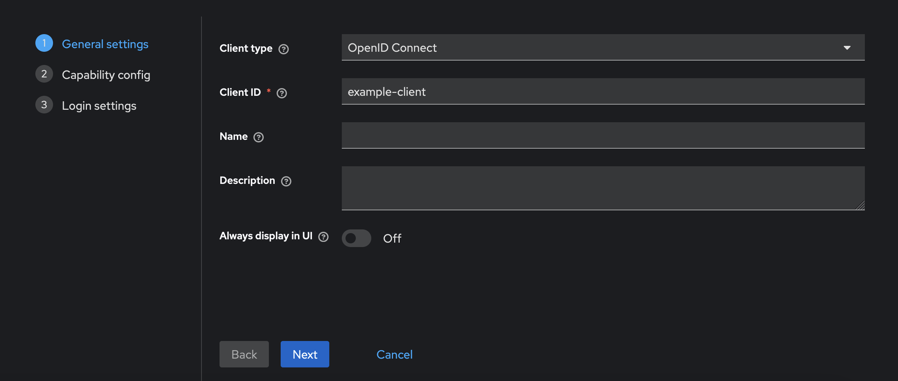

# Chapter I: introduction to OAuth2 with Keycloak
We mentioned that OAuth2 is a protocol, a _standard_, not something we can run: OAuth2 is a specification, not an application.<br>
To leverage the OAuth2 standard we must use a OAuth2-compliant __identity management provider__ (IDP), which is fancy for "a system composed by one or more servers that all run an application that does the authorization and authentication instead of us".
<br>
One of the leading IDPs is [Keycloak](https://www.keycloak.org/), developed and maintained by RedHat, which also happens to be completely open source and self-hostable. Other than that, Keycloak has a [vibrant and large community](https://github.com/keycloak/keycloak/pulls), definitely a plus when it comes to open source self-hostable projects.

## The nuts and bolts of OAuth2
How do we effectively gain access to resources protected by an OAuth2 authorization scheme? The answer is simple: through a __flow__, a standard set of steps that the IDP will go through while authenticating a client's identity.<br>
The main flows that we will use in our journey through this project are the __authorization code flow__ and the __service account flow__. <br>
The first is used when the application that is requesting access to a protected resource is a __web__ or __mobile__ application, or really any application that is __user-driven__, whereas the latter is used when we need to authenticate __requests made from other programs that are not user-driven__ (i.e. a microservice!).<br>
Both of these flows will output two, very important, pieces of information: the __`access token`__ and the __`refresh token`__, which are the foundations to OAuth2's authorization system.<br>

- The `access token` is used to __issue authenticated requests to our microservices__. It's our passport __into the system__ and it has a very short lifespan: this is a key characteristic of access tokens; tokens that grant __access__ to protected resources _should_ have a short TTL, because __tokens leak__, security protocols are __breached__, things always take the wrong turn with microservices. For these reasons, access tokens should live as short as possible, because, if stolen, they will grant access to the system on behalf of the user that got the token in the first place.
This token can be `Opaque`, a random, meaningless string, or a `JWT` that encodes information. We will use a `JWT`.
- The `refresh token` is used to __get new access tokens when they expire__. They are (very) long-lived with respect to __access tokens__ and, needless to say, they are equally important and must be stored carefully and safely.

### Authorization code flow
Here's a picture that describe how the user gets into the system with the authorization code flow.<br>
We will use the "basic" version, without [PKCE](https://oauth.net/2/pkce/), because of simplicity and also because PKCE is mainly related to mobile apps (but it's an additional layer of security that every client can benefit of, web apps included).


1. the user clicks on the login button (or follows a login link);
2. the backend issues an authorization code request, this starts a redirection process to the login form. The authorization code will make sure that the request for the access and refresh token is not forged.
3. the user gets redirected to the login form;
4. the user authenticates;
5. if the credentials are correct, the auth code is issued and sent to the backend;
6. once the auth code is received, the backend issues another request to retrieve the tokens. Note, again, that the auth code's presence is critical to mitigate security risks: by issuing an auth code, the client __never directly contacts the OAuth2 server__ and the authentication flow is completely delegated to the server. This enforces security and doesn't allow privileged access to the OAuth2 server from potentially vulnerable clients; imagine what would happen if the authorization code didn't pass through the server, but was instead passed to a vulnerable client: if the authorization code gets intercepted by an attacker, the entire authorization session would be stolen, and malicious third parties could authenticate on the vulnerable client's behalf. Instead, it's the backend that requests credentials with the authorization code and the OAuth2 server is configured to accept authentication requests from the server only, thus, hardening security;
7. the OAuth2 server validates the code and the credentials;
8. the tokens are issued and...
9. ...a session is issued between the backend and the frontend;
10. the frontend can now make authenticated requests to other microservices;

### Service account flow
As already mentioned, the service account flow is used by non-user driven processes, i.e. applications that aggregate user data (CQRS microservices) or notification services that query other microservices for reports and similar things.
.

1. the microservice has some pre-generated credentials with which it will make a request for tokens;
2. the OAuth2 service validates the credentials...
3. ...and returns the tokens to the microservice;
4. authenticated requests can now be sent to other microservices.

Notice how the flow is much shorter and simpler: that's because one can make stronger assumptions about the microservice, which means that it can be presumed much less likely to be vulnerable with respect to malicious third parties.<br>
Nevertheless, credentials on the microservice must be safely handled and rotated periodically.

### Access token usage
Once the access token is obtained, it can be used to make authenticated request towards the protected API (in the picture above we can represent the protected API with the "microservices" block).<br>
It is the microservice's responsibility, then, to  verify the token's validity.<br>
For simplicity's sake, we are not going to delve into cryptographical details on how JWTs are created: we just need to know that JWTs are cryptographically signed strings that encode information in JSON format.<br>
The signing happens on the OAuth2 server's side with a private key and each microservice that will need to validate tokens issued by this server will receive a copy of the server's public key: this way, the verification is done completely "offline", meaning that microservices won't need to interrogate the OAuth2 server every time it receives an authenticated request.

We will see in detail how this process works in the next chapters, for now that's all we need to know.

### Refresh token usage
Once the access token expires, verifying the JWT will return an error. That's when the client should __refresh__ its access token.
<br>
The refresh mechanism is very simple: the OAuth2 server exposes a refresh token endpoint to which applications can request new access tokens.<br>
Note that here, too, the process happens entirely on the backend side (for the same reasons we talked about before) and it's the auth microservice's (the one represented in the first image of this section) responsibility to ensure the token is refreshed correctly.
<br>
Here's a quick breakdown of how the process works, again, we will see it in much more detail later.<br>


## Keycloak
Now that we talked about the theory, let's put it into practice with Keycloak.
<br>
We will use Keycloak's Docker image because we will model our system through a Docker Compose file for simplicity and reproducibility.
### Starting up
Let's fire up a basic Keycloak instance: to do so, use the following `compose.yml` file
```yaml
keycloak:
    build:
      context: .
      dockerfile: ./path/to/Dockerfile
      network: host
    entrypoint: ["/opt/keycloak/bin/kc.sh", "start-dev"]
    environment:
      - KC_HOSTNAME=localhost
      - KC_HOSTNAME_PORT=8080
      - KC_HOSTNAME_STRICT=false
      - KC_HOSTNAME_STRICT_HTTPS=false
      - KEYCLOAK_ADMIN=admin
      - KEYCLOAK_ADMIN_PASSWORD=admin
    ports:
      - 8080:8080
```
Keycloak requires a Dockerfile to start, because it needs to generate a private/public keypair for crypto operations:
```Dockerfile
FROM quay.io/keycloak/keycloak:latest as builder

# Enable health and metrics support
ENV KC_HEALTH_ENABLED=true
ENV KC_METRICS_ENABLED=true

WORKDIR /opt/keycloak
# for demonstration purposes only, please make sure to use proper certificates in production instead
RUN keytool -genkeypair -storepass password -storetype PKCS12 -keyalg RSA -keysize 2048 -dname "CN=server" -alias server -ext "SAN:c=DNS:localhost,IP:127.0.0.1" -keystore conf/server.keystore
RUN /opt/keycloak/bin/kc.sh build

FROM quay.io/keycloak/keycloak:latest
COPY --from=builder /opt/keycloak/ /opt/keycloak/
```
Everything is ready, we just need to start our container:
```bash
docker compose up 
````
Note: we are not going to delve into the details of a production-ready deployment with Keycloak because it's out of the scope of this project. This setup will be the same we are going use throughout the whole project and, of course, it's not production ready since it uses an in-memory database to store user information, which is not ideal for a highly available environment.

### Realms
Now that we fired up our Keycloak instance, let's navigate to [http://localhost:8080](http://localhost:8080) and login with the default credentials ("admin", "admin"). The interface should look something like this:


Keycloak introduces the concept of __realms__ as a way to _namespace_ different configurations and users.<br>
A realm in Keycloak is essentially a __tenant__, which is a space where all the information about a set of users and applications is managed. Each realm is isolated from other realms, allowing for multi-tenancy within a single Keycloak instance.
<br>
Let's imagine we were to have an application that runs two environments: staging and production. We certainly wouldn't want to have staging and production users mixed, so we would have to create two realms (i.e. _staging-realm_ and _production-realm_) to separate the users.<br>
The staging environment would then refer to the first realm, whereas the production one would use the latter.

Keycloak starts, by default, with the __master__ realm already created, which is a management realm, used to create and administrate other realms. You should not use this realm for production usage, because access to this realm can compromise the instance's configuration.
<br>
Let's create a new realm by clicking on the top-left dropdown and onto "Create realm":

Just input its name, we don't have a resource file, and then proceed.


### Clients
Let's talk about how applications can interact with Keycloak, meaning, how can applications perform all the flows and tasks we mentioned before?<br>
Keycloak, and, in general, all OAuth2 servers, introduces the concept of _clients_, that represents something, an application, trying to use OAuth2 functionality to access a protected resources.<br>
There are __confidential clients__ and __public__ clients:

- confidential clients are applications that are able to securely authenticate with the authorization server. In our previous example, the confidential client is the auth microservice. Basically, confidential clients are the middlemen between the user and the authorization server. Confidential clients are represented by a `client_secret` and a `client_id`;
- public clienst are basically applications running in a browser or on a mobile device. They are essentialy the end users of access and refresh tokens.

In other words, public clients rely on confidential clients to obtain credentials and then they use the latter to access private resources.
<br>
Let's see how to create a client and how to use them.
#### Creating a confidential client in Keycloak
<div style="display: flex; flex-direction: column;">
On the left panel of Keycloak's interface, click on "Clients":

</div>
In the following screen, click on "Create client".
<br>

You can just enter the __client id__ and then proceed:

